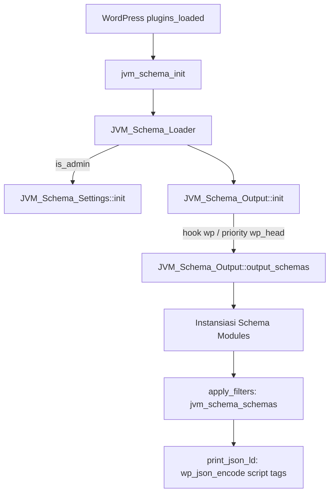

# AGENTS.md — Developer & AI Context Guide

Dokumen ini berisi arsitektur ringkas, struktur file, flow eksekusi, serta konvensi kode plugin **JVM Schema** agar AI/developer langsung memahami konteks proyek tanpa membaca seluruh isi codebase.

---

## 1. Overview Proyek
- **Nama Plugin**: JVM Schema (`jvm-schema`)
- **Fungsi Utama**: Dynamic structured data / JSON-LD generator untuk WordPress dan WooCommerce.
- **Standar Output**: Script tag JSON-LD di hook `wp_head` (`<script type="application/ld+json">`).
- **Filosofi**: Clean, decoupled, zero-bloat, valid schema.org spec, anti-duplikasi dengan default schema WooCommerce.

---

## 2. Struktur Direktori & File Penting

```
jvm-schema/
├── jvm-schema.php                     # Main bootstrap file: definisi konstanta, activation hook, inisialisasi awal
├── README.md                          # Dokumentasi user & fitur publik
├── AGENTS.md                          # Dokumentasi arsitektur untuk AI & developer
├── admin/
│   └── views/
│       └── settings-page.php          # Template view form pengaturan admin
├── assets/
│   └── admin.css                      # Styling UI admin settings
└── includes/
    ├── class-jvm-schema-loader.php    # Loader bootstrap (admin settings & front-end output)
    ├── class-jvm-schema-settings.php  # Settings API, tabbed dashboard, metaboxes post/product/user
    ├── class-jvm-schema-output.php    # Hook ke `wp_head`, orkestrasi perakitan dan output semua schema
    └── schemas/                       # Modul generator per schema (independent classes)
        ├── class-jvm-schema-website.php       # WebSite schema (SearchAction / Sitelinks Searchbox)
        ├── class-jvm-schema-webpage.php       # WebPage schema
        ├── class-jvm-schema-organization.php  # Organization & LocalBusiness schema
        ├── class-jvm-schema-breadcrumb.php    # BreadcrumbList schema
        ├── class-jvm-schema-product.php       # Product & Offers schema (WooCommerce Simple & Variable)
        ├── class-jvm-schema-article.php       # Article / BlogPosting schema
        └── class-jvm-schema-faq.php           # FAQPage schema (Smart parser & custom tabs support)
```

---

## 3. Flow Eksekusi



1. **Inisialisasi**:
   - `jvm_schema_init()` di [`jvm-schema.php`](jvm-schema.php) dijalankan pada `plugins_loaded`.
   - Menginstansiasi `JVM_Schema_Loader`.
   - `JVM_Schema_Product::init()` dipanggil early untuk mematikan default structured data WooCommerce via filter `woocommerce_structured_data_product`.
2. **Output Frontend**:
   - Hook `wp` mendaftarkan `output_schemas` ke action `wp_head` dengan prioritas dari option `jvm_schema_head_priority` (default `10`).
   - Setiap class di `includes/schemas/` memiliki method `get_schema()` yang mengembalikan `array|null`.
   - Hasil difilter lewat hook `jvm_schema_schemas` sebelum dicetak sebagai JSON-LD.

---

## 4. Modul Schema & Konvensi

### 4.1. JVM_Schema_FAQ ([`class-jvm-schema-faq.php`](includes/schemas/class-jvm-schema-faq.php))
- **Trigger**: `is_singular()` dan option `jvm_schema_enable_faq === '1'`.
- **Sumber Konten**:
  - `post_content` (deskripsi utama pos/halaman/produk).
  - Custom tabs WooCommerce (`_custom_product_tabs`), kompatibel dengan plugin custom tabs (misal `woocommerce-custom-tabs`).
- **Deteksi Judul Tab FAQ**: Menggunakan regex `is_faq_tab_title()` untuk menangkap keyword tab: `FAQ`, `FAQs`, `Q&A`, `QNA`, `Tanya Jawab`, `Pertanyaan`, dll.
- **Strategi Ekstraksi**:
  1. Explicit wrapper `<div class="jvm-faq">` (jika judul tab FAQ cocok, otomatis dibungkus wrapper ini).
  2. Question Headings (`<h1>` - `<h6>` diakhiri `?` atau kata tanya ID/EN).
  3. `<details>` / `<summary>` accordion.
  4. Inline Q&A di elemen `<li>`.

### 4.2. JVM_Schema_Product ([`class-jvm-schema-product.php`](includes/schemas/class-jvm-schema-product.php))
- **Trigger**: `is_product()`.
- **Dukungan**: Simple product & Variable product (multi-offers).
- **Overrides**: Meta post `_jvm_schema_product_brand`, `_jvm_schema_product_gtin`, `_jvm_schema_product_mpn`, `_jvm_schema_product_rating`, `_jvm_schema_product_review_count`, `_jvm_schema_product_condition`, `_jvm_schema_product_price_valid_until`.
- **Fallback**: Menggunakan default global settings jika meta per-produk kosong.

### 4.3. JVM_Schema_Organization ([`class-jvm-schema-organization.php`](includes/schemas/class-jvm-schema-organization.php))
- Mendukung tipe `Organization` atau `LocalBusiness` (Store, Restaurant, dll).
- Parsing opening hours (mode per-hari atau format pola teks).
- Scope kemunculan: `all`, `homepage`, atau `specific` pages.

---

## 5. Rencana & Future Roadmap (Future Proofing)

- **Spesifikasi Produk (Custom Tab -> Product Schema)**:
  - Tab seperti "Spesifikasi" / "Specification" / "Specs" yang berisi `<table>` direncanakan diekstrak menjadi `additionalProperty` (`PropertyValue` name/value) di `JVM_Schema_Product`.
- **Modularisasi Settings**:
  - `class-jvm-schema-settings.php` saat ini cukup besar (~1100 baris); dapat dipertimbangkan pemecahan ke sub-handlers jika fitur terus bertambah.
